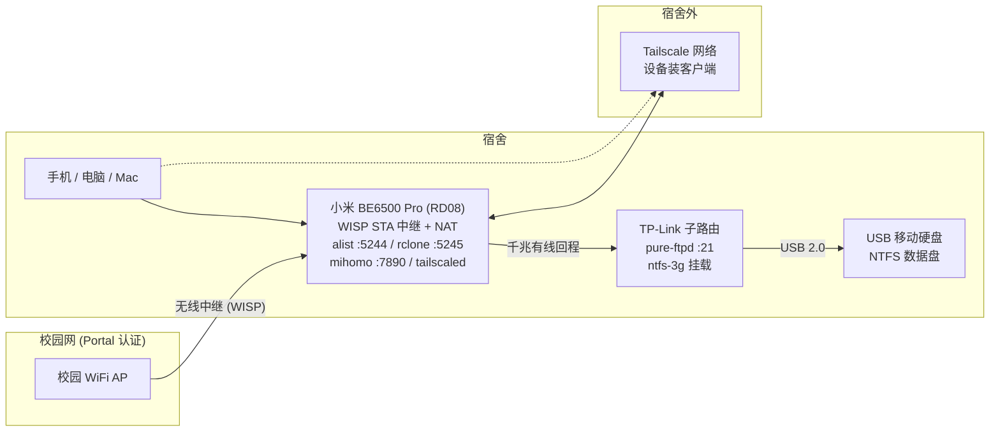

# 小米 BE6500 Pro (RD08) 校园网中继 + NAS 全链路指南

> 自有设备的完整改造实录：**SSH 解锁 → 校园网 WISP 中继 → NAT 共享 → 代理注入 → TP-Link 子路由 → alist NAS → Tailscale 外网访问 → 稳定性治理**。
> 全文**不含任何真实凭据**（密码/学号/令牌均用占位符），所有操作只针对自己购买的路由器。

[](LICENSE)

## 最终架构



- **宿舍内**：浏览器开小米的 `:5244`（alist 网页/WebDAV），或文件管理器挂 WebDAV
- **宿舍外**：设备装 Tailscale 登录同一账号 → 固定虚拟 IP 直达 NAS
- **多设备共享**：全校 WiFi 只认证 1 台路由器，宿舍内所有设备经 NAT 出网

## 八个阶段导览

| # | 文档 | 一句话 |
|---|---|---|
| 1 | [SSH 解锁与固化](docs/01-ssh-unlock.md) | 降级到有已知漏洞的官方固件 → 公开工具开 SSH → 固化 root（改密/改端口/防 OTA） |
| 2 | [WISP 中继 + NAT](docs/02-wisp-relay-nat.md) | 新建 STA 接口连校园 WiFi，防火墙区 + MASQ；**双上行抢默认路由**是最大坑 |
| 3 | [Portal 认证保活](docs/03-portal-keepalive.md) | Web 认证流程、每分钟自愈 keeper、开机加速、PC 直连会顶掉认证的坑 |
| 4 | [mihomo 代理注入](docs/04-proxy-mihomo.md) | 显式代理 → TCP REDIRECT（TPROXY 失败教训）→ 节点轮换 → exclude-filter 修 urltest |
| 5 | [TP-Link 有线回程子路由](docs/05-tplink-subrouter.md) | 免拆机开 root → 有线回程（不打无线环）→ 同 SSID 合并 → 持久化铁律 |
| 6 | [alist NAS](docs/06-nas-alist.md) | 裸二进制 alist + rclone WebDAV 桥 + FTP；ntfs-3g uid 根因修复；重启免疫看门狗 |
| 7 | [Tailscale 外网访问](docs/07-tailscale.md) | userspace 模式（内核 TUN 会崩机器的教训）、授权一次永久生效 |
| 8 | [稳定性治理](docs/08-stability-oom.md) | /tmp OOM → WiFi 消失的完整因果链、看门狗 v4、全链路体检清单 |

另有 [pitfalls.md](docs/pitfalls.md)：跨主题大坑速查表。

## 成绩单（全部实测）

- 全校 WiFi **单账号**下宿舍内 10+ 设备共享上网，认证保活自动自愈（断网 ~4 分钟内恢复）
- NAS：网页/多端 WebDAV/FTP 三通道；**写 3.08 / 读 3.5 MB/s**（USB 2.0 + MIPS 单核 + FUSE 的物理上限）
- 中文文件名零乱码；路由器**重启/断电后全部服务自动恢复**（NAS ~2 分钟、校园网 ~4 分钟），无需人工
- 连续运行 39 小时零重启、零 OOM；外网穿透延迟 ~0.2s

## 红线与免责

1. **只动自己的设备**；路由器变砖风险自担，动手前做好全分区备份
2. 校园网使用条款自行评估遵守；本指南不提供任何绕过计费/认证攻击的方法，只是"一台设备认证 + NAT 共享"的标准用法
3. 公开发布的内容**永远不含凭据**；你在自己的部署里用到的所有密码请用环境变量或本机配置文件管理
4. 官方固件降级/开启 SSH 均通过公开工具完成，不涉及任何私有漏洞

## 目录结构

```
docs/      8 篇阶段文档 + pitfalls 速查
scripts/   脱敏脚本（凭据一律走环境变量）
LICENSE    MIT
```

## 脚本通用约定

- 小米 SSH：`paramiko==3.5.1`（5.x 与老 dropbear 握手失败）
- 凭据：`ROUTER_PASS` / `FTP_PASS` / `ALIST_PASS` 等环境变量，**绝不硬编码**
- 路由器持久化：小米 `/data`（掉电保留）vs `/tmp`（内存盘，重启即清）；TP-Link 用 `config.sh save` 落盘

## License

MIT
